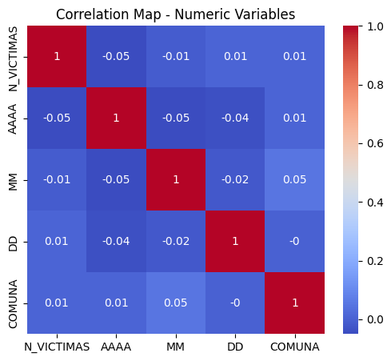
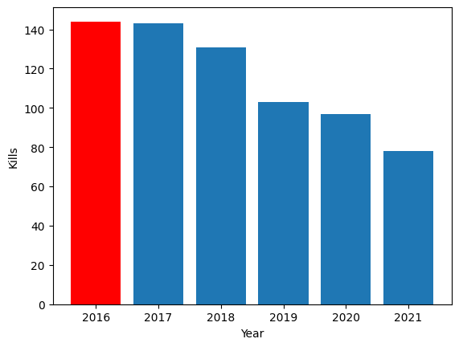
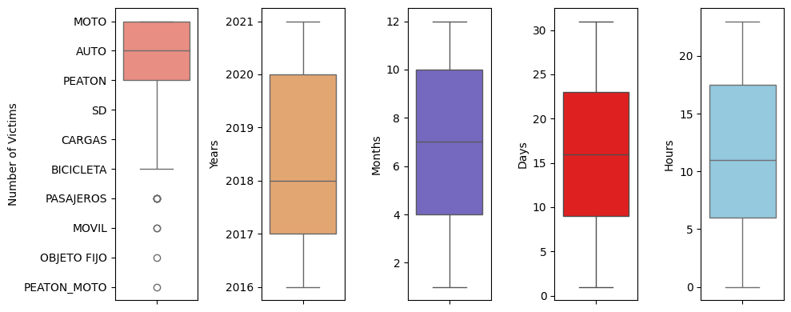
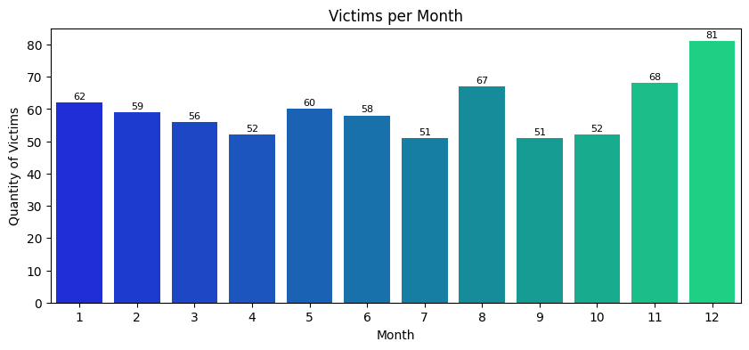

# CrashChronicles

Welcome, this repository has been created to propose a solution to the crash collisions in Argentina, which is one of the biggest problems facing the country.

Inside this project we could appreciate the correlation map between similar and numeric variables, here's an example of what I'm talking about: 

Also, in our exploratory analysis we will cover important graphs such as kills per year:

Not forgeting the outliers analysis and constant boxplots visualizing it's distribution of our data:

And measuring victims per month and other important analytics.

I hope you find useful and inspiring in this repository. See you next time!

Repository with requirements: https://github.com/soyHenry/PI_DA/tree/Full_Time
